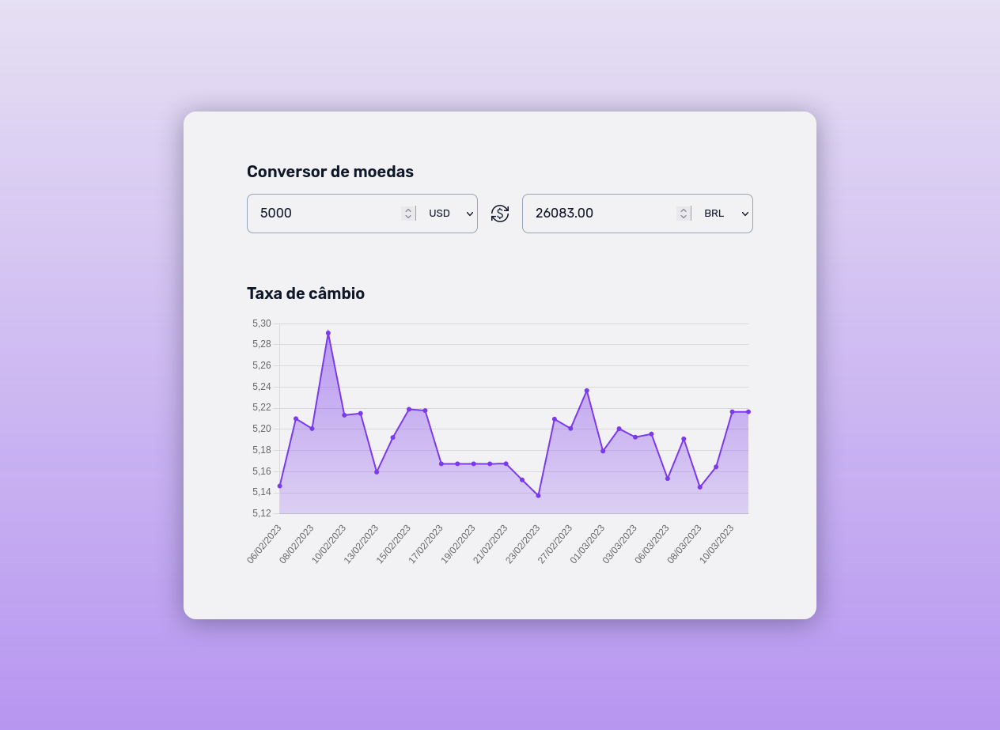
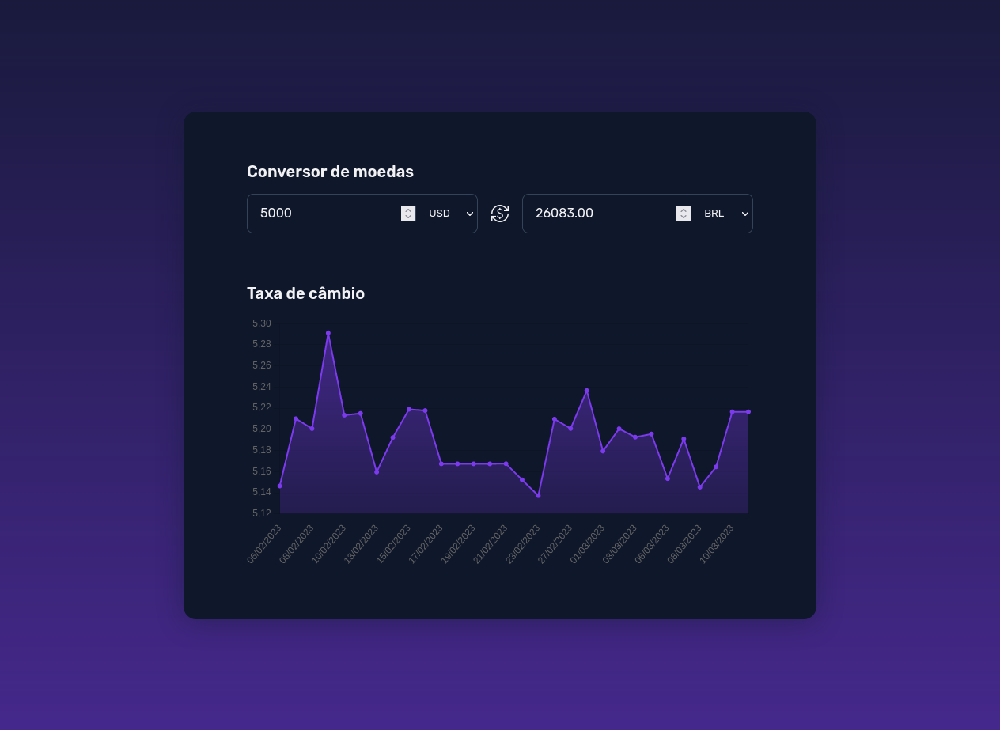

# Desafio 9 - Conversor de moeda

  
  
  
  

## Imagem

	
	

## Tecnologias

Esse projeto foi desenvolvido com as seguintes tecnologias:

- HTML e CSS
- JavaScript
- Git e Github
- Figma

## Layout do projeto

- [FIGMA](https://www.figma.com/community/file/1212757179376046656)
